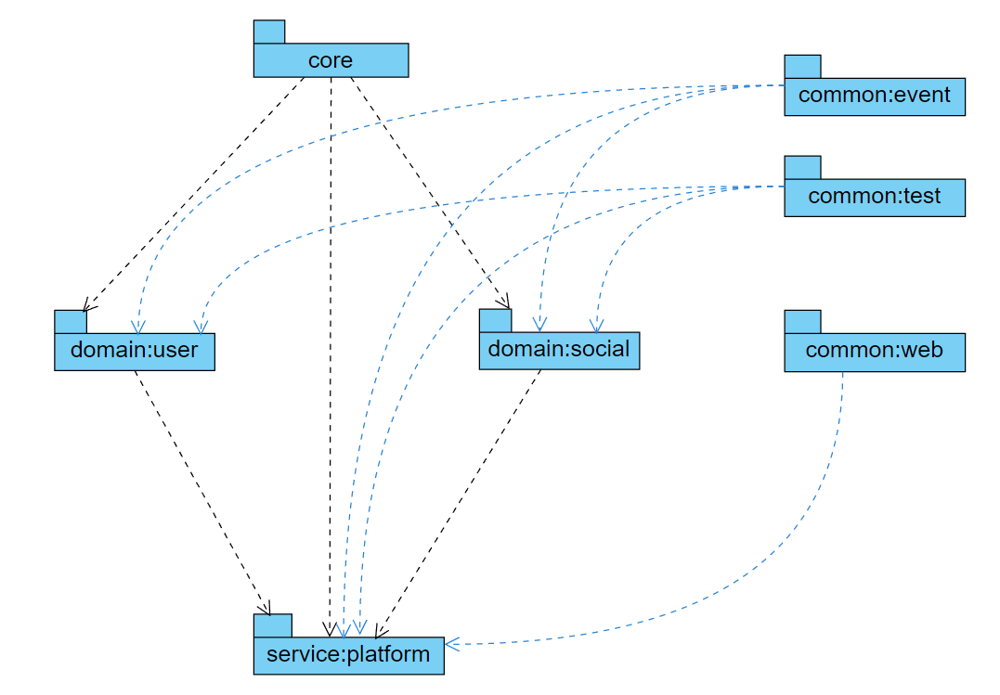
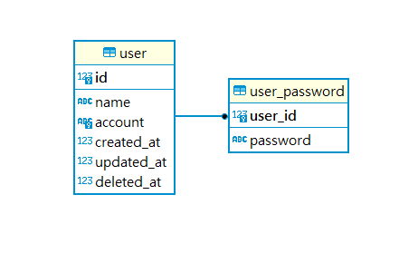
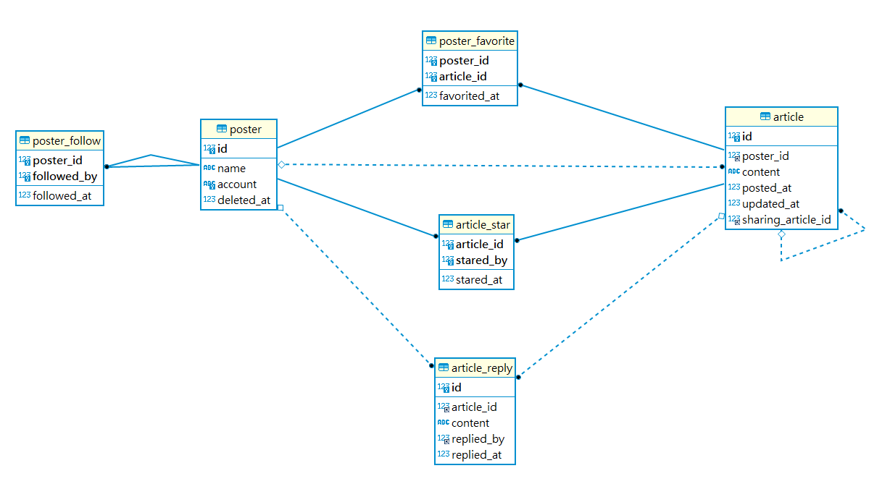
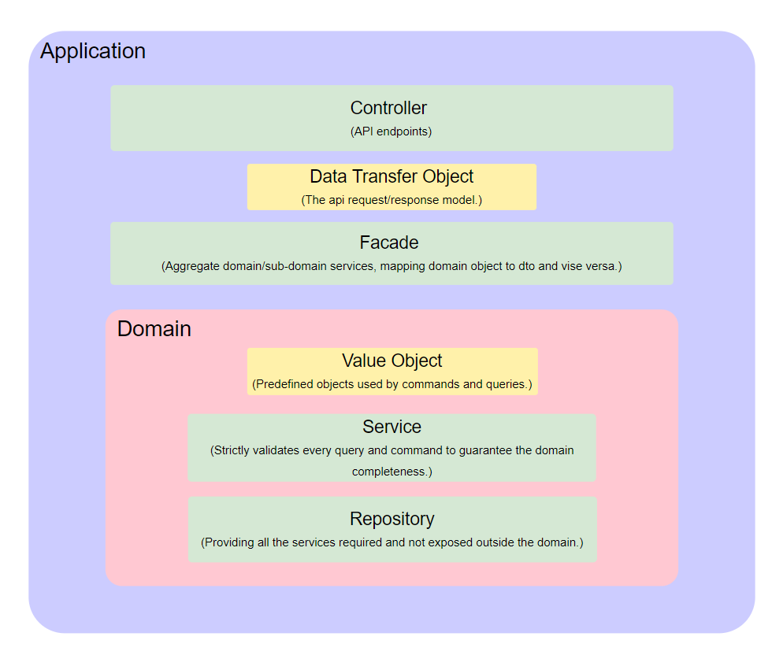

# example.social

----

1. [Getting Started](#getting-started)
2. [Projects Dependency](#projects-dependency)
3. [ER Model](#er-model)
4. [Designing Concept](#designing-concept)
----

# Getting Started

1. Start the app
````
./gradlew :service:platform:bootRun 
````
2. Visit the api doc <http://127.0.0.1:8080/swagger-ui/index.html>
3. Register a user or there are some predefined user account (test1, test2, test3, test4)
   , all of them has the same password '123456'.
4. Try it!


---

# Projects Dependency



---

# ER Model

## User Domain



## Social Domain


---

# Designing Concept

